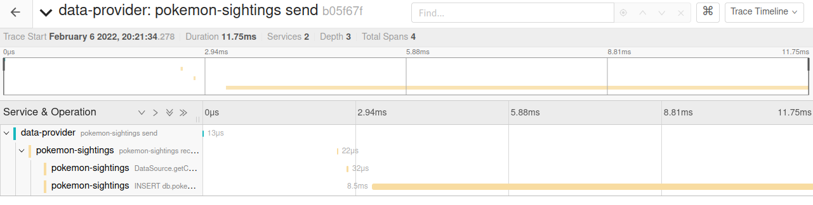

# OpenTelemetry Demo
Distributed tracing demo with OpenTelemetry.

The project consists of a [data provider](data-provider) which generates random data using the [Datafaker](https://www.datafaker.net/)
library. The data is then wrapped in a proto message before being published to a Kafka topic every 2 seconds.
Topics are then consumed by the [receiver](pokemon-sightings), persisted, and logged to the console.

There are also a couple of REST endpoints for retrieving stored Pokémon sightings from the database.
* http://localhost:8080/pokemon-sightings/id/{id}
* http://localhost:8080/pokemon-sightings/name/{name}

Traces are automatically added to Kafka clients and REST API  by Quarkus and OpenTelemetry. Traces for database transactions are added
by wrapping the datasource in a special OpenTelemetry datasource tracing wrapper as described 
[here](https://github.com/open-telemetry/opentelemetry-java-instrumentation/tree/main/instrumentation/jdbc/library).


## How to run it
```
    # Run Jaeger, OTEL Collector, and MySQL
    docker-compose -f dev-services/docker-compose up -d
```
```
    # Build and install shared message type
    mvn -f message-data-type/pom.xml clean install
```
```
    # Start Pokemon sighting application
    mvn -f pokemon-sightings/pom.xml quarkus:dev
```
```
    # Start data provider
    mvn -f data-provider/pom.xml quarkus:dev
```

Visit http://localhost:16686/search to check out the collected traces in Jaeger.

